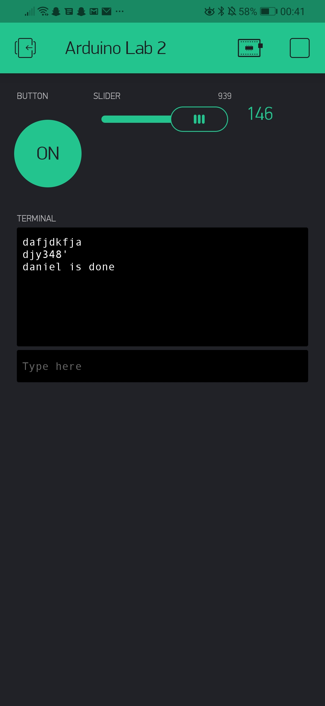

Name: daniel yang

EID:  djy348

Team  F13

## Questions

1. What is the purpose of an IP address?

   The IP address identifies the machines connected to the interconnection of networks

2. What is a DNS? What are the benefits of using domain names instead of IP addresses?

    DNS is called Domain Name Service, which maps a symbolic name to its corresponding IP address.
    The benefic of using domain names is that people can memorize the name a lot easily

3. What is the difference between a static IP and a dynamic IP?

    static IP doesn't change but dynamic IP changes over time

4. What is the tradeoff between UDP and TCP protocols?

    TCP is reliable and connectionbased but UDP is connectionless but unreliable

5. Why can't we use the delay function with Blynk?

    Blynk is event based, using delay() will mess up the timing and break it. 

6. What does it mean for a function to be "Blocking"?

    blocking means that nothing else can run while it is running, effectively wasting time we could spend elsewhere.

7. Why are interrupts useful for writing Non-Blocking code?

    Interrupts stop the main program and runs the interrupt routing, and thus it stops everything else that was running before. 

8. What is the difference between interface and implementation? Why is it important?

   An interface defines how a function is called, and is usually in a header file while an implementation describes what the function actually does. It's important because 
   some framework provide the interface but not implementation

9. Screenshot of your Blynk App:

    
